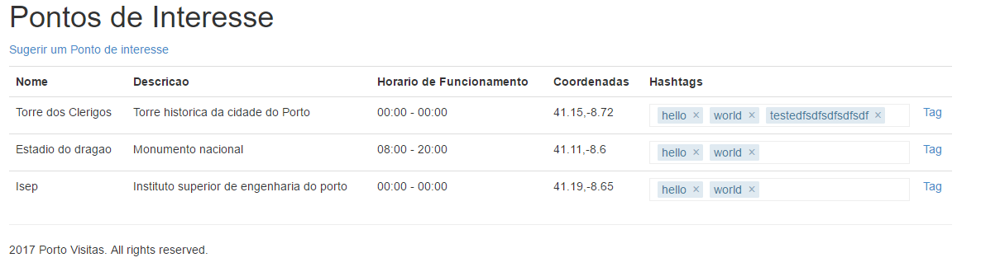
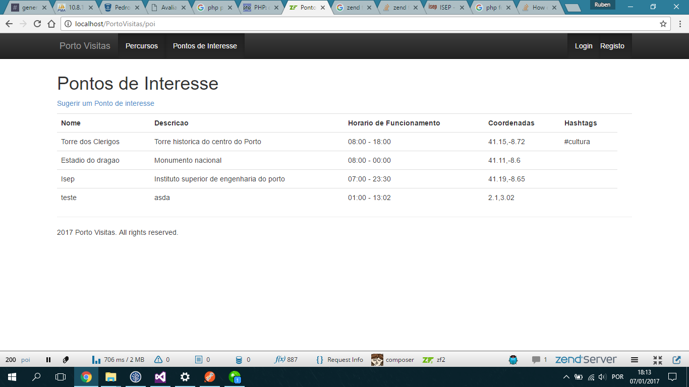

# FullStack_Platform

This is an academic project that consisted in the development of a Points Of Interest (POI) management system, with user (tourist) management and courses creation and edition.
It includes features such as hashtags, Graphic path preview and best path generation.

